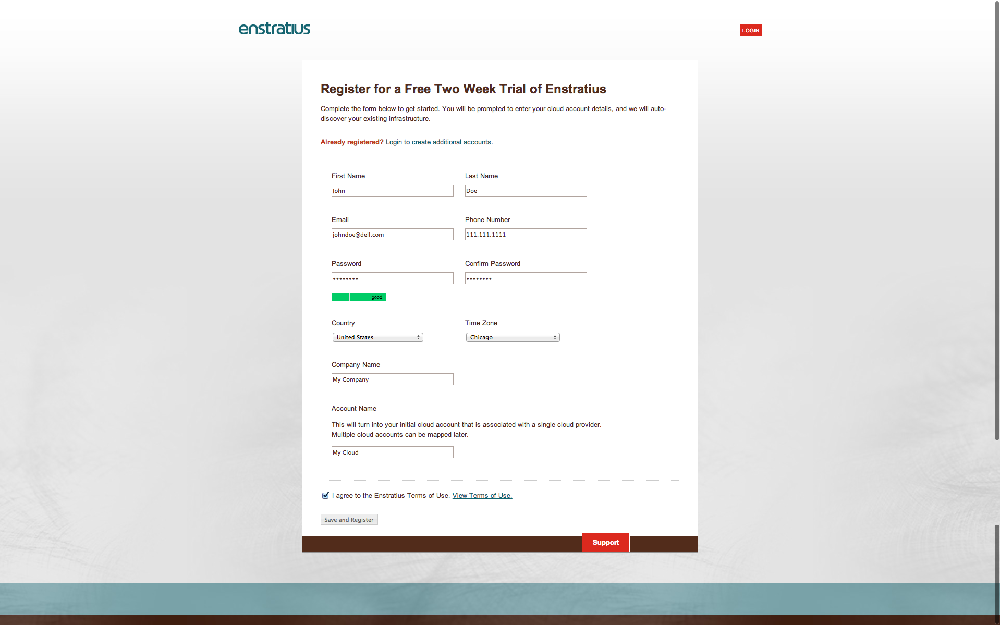
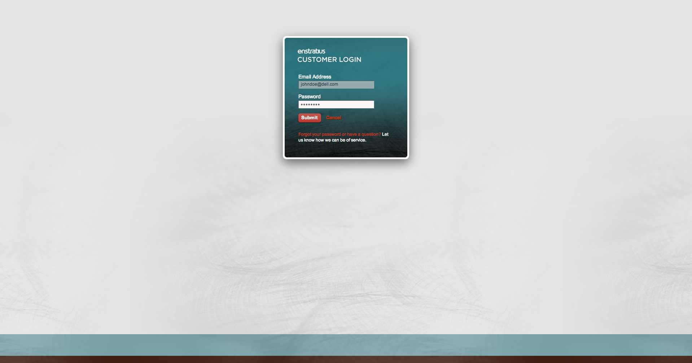
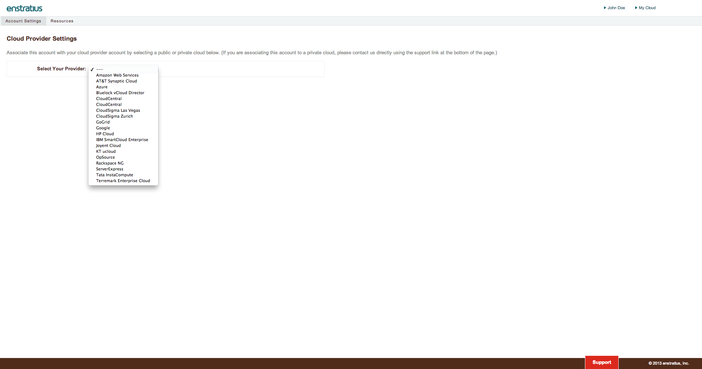

.. _post_install:

Post Install
------------

.. _register:

Register
~~~~~~~~

In your browser, navigate to https://cloud.mycompany.com/page/1/register.jsp (https://cloud.mycompany.com/pages/public/register.jsp if using version h.4.2+),
replacing cloud.mycompany.com with the url you specified in in your attributes file.

.. note:: You may have to modify your DNS settings via a hosts file entry or other means
   to reach the URL.

Successful registration will direct the user to a page where cloud credentials can be
entered. Before proceeding, let's start the worker and monitor services.

   Registration

Login
~~~~~~~~

   Login

Add a Cloud
~~~~~~~~~~~

   Add a Cloud

List of Clouds
~~~~~~~~~~~~~~

.. raw:: html
	
	<a href="./images/post_install_aws.png">Amazon Web Services</a> 
	<a href="./images/post_install_att.png">AT&T Synaptic Cloud</a> 
	<a href="./images/post_install_azure.png">Azure</a> 
	<a href="./images/post_install_bluelock.png">Bluelock vCloud Director</a> 
	<a href="./images/post_install_cloudcentral.png">CloudCentral</a> 
	<a href="./images/post_install_cloudsigma_lv.png">CloudSigma Las Vegas</a> 
	<a href="./images/post_install_cloudsigma_z.png">CloudSigma Zurich</a> 
	<a href="./images/post_install_gogrid.png">GoGrid</a> 
	<a href="./images/post_install_google.png">Google</a> 
	<a href="./images/post_install_hp.png">HP Cloud</a> 
	<a href="./images/post_install_ibm.png">IBM SmartCloud Enterprise</a> 
	<a href="./images/post_install_joyent.png">Joyent</a> 
	<a href="./images/post_install_kt.png">KT ucloud</a> 
	<a href="./images/post_install_opsource.png">OpSource</a> 
	<a href="./images/post_install_rackspace.png">Rackspace NG</a> 
	<a href="./images/post_install_serverexpress.png">ServerExpress</a> 
	<a href="./images/post_install_tata.png">Tata InstaCompute</a> 
	<a href="./images/post_install_terremark.png">Terremark Enterprise Cloud</a> 

    
MySQL
~~~~~

The root password for MySQL was generated at the time of installation. The password will
be located in ``/etc/mysql/grants.sql`` on Debian derivatives and
``/etc/mysql_grants.sql`` on RHEL and CentOS.
